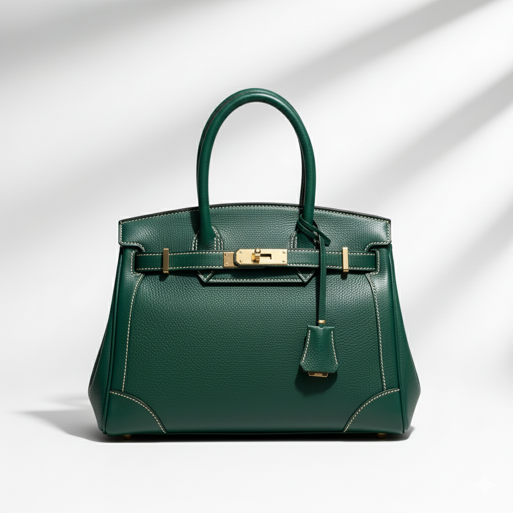

<h1>🎨 Gemini Prompt: Image Edit</h1>

This page showcases example prompts on how to futher enhance AI generated images using Nano Banana

<table>
  <tr>
    <th style="width:70%; word-wrap: break-word;">Prompt</th>
    <th style="width:30%;">Sample Image</th>
  </tr>

  <tr>
    <td style="word-wrap: break-word;">
Create a high-resolution, studio-quality product photo of a luxury leather handbag. The bag is centered, sharp, and well-lit against a clean white background with soft shadows for an e-commerce look. Capture fine details such as the texture of the leather, stitching, and metallic hardware. Lighting should be even and professional, highlighting the bag’s shape and craftsmanship. The composition should be minimal and elegant, focusing entirely on the product.
    </td>
    <td>
      
    </td>
  </tr>

  <tr>
    <td style="word-wrap: break-word;">
    <b>Change Color</b>
     
    Change the handbag color to a rich emerald green leather with gold accents.
    </td>
    <td>
     
    </td>
  </tr>

  <tr>
    <td style="word-wrap: break-word;">
    <b>Combine Image</b>
     
    Place the handbag naturally in the uploaded person’s hand as they carry it, ensuring correct scale, grip, and realistic shadow blending.
    </td>
    <td>
      
    </td>
  </tr>
  <tr>
    <td style="word-wrap: break-word;">
       <b>Change Background Setting</b>
     
    Replace the background with a luxury boutique interior softly lit with warm tones, keeping the focus on the handbag.
    </td>
    <td>
    
    </td>
  </tr>
</table>
