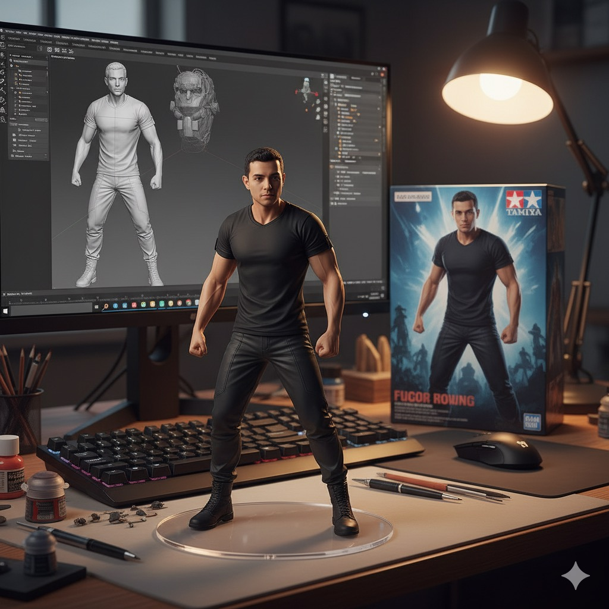
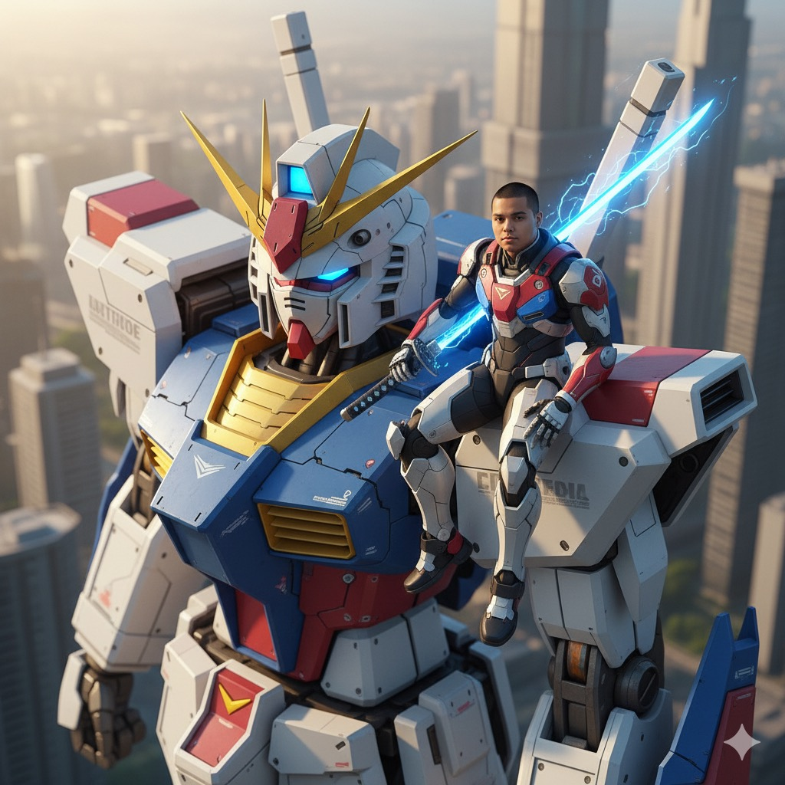
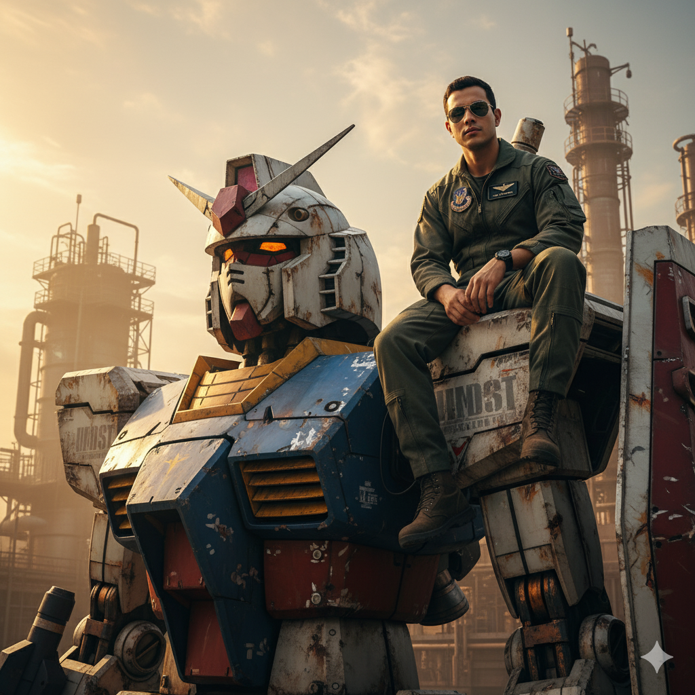
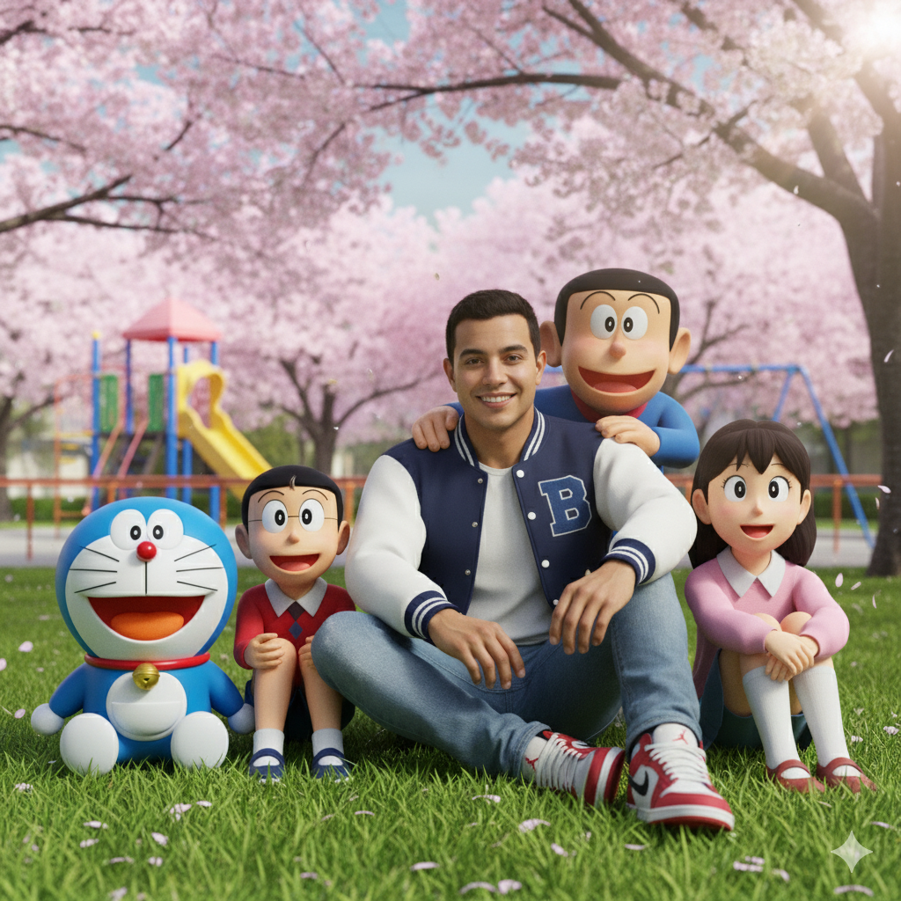
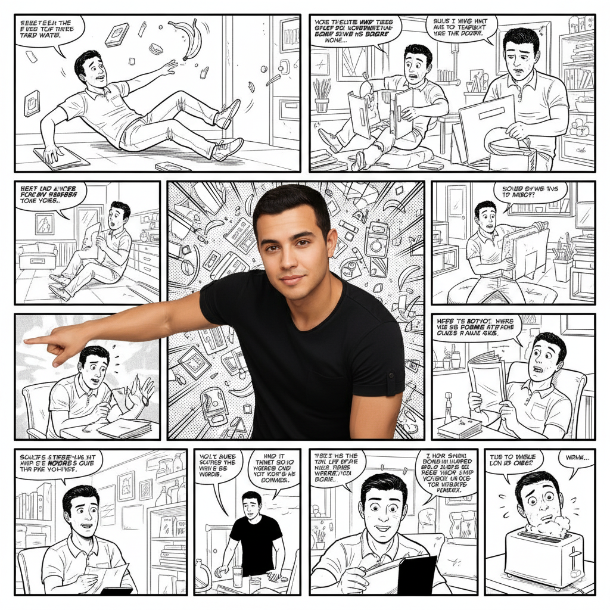
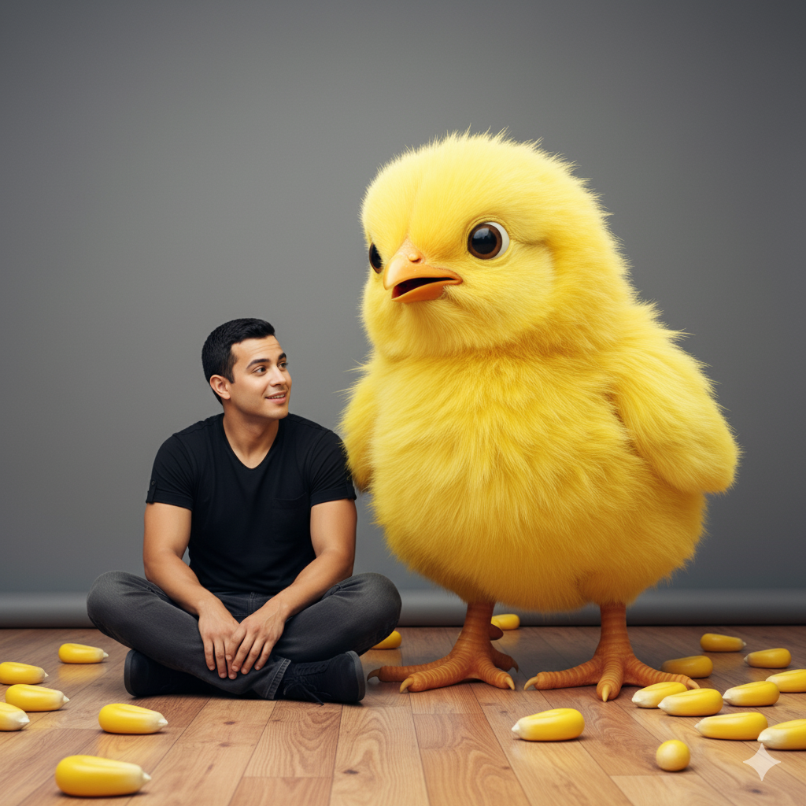
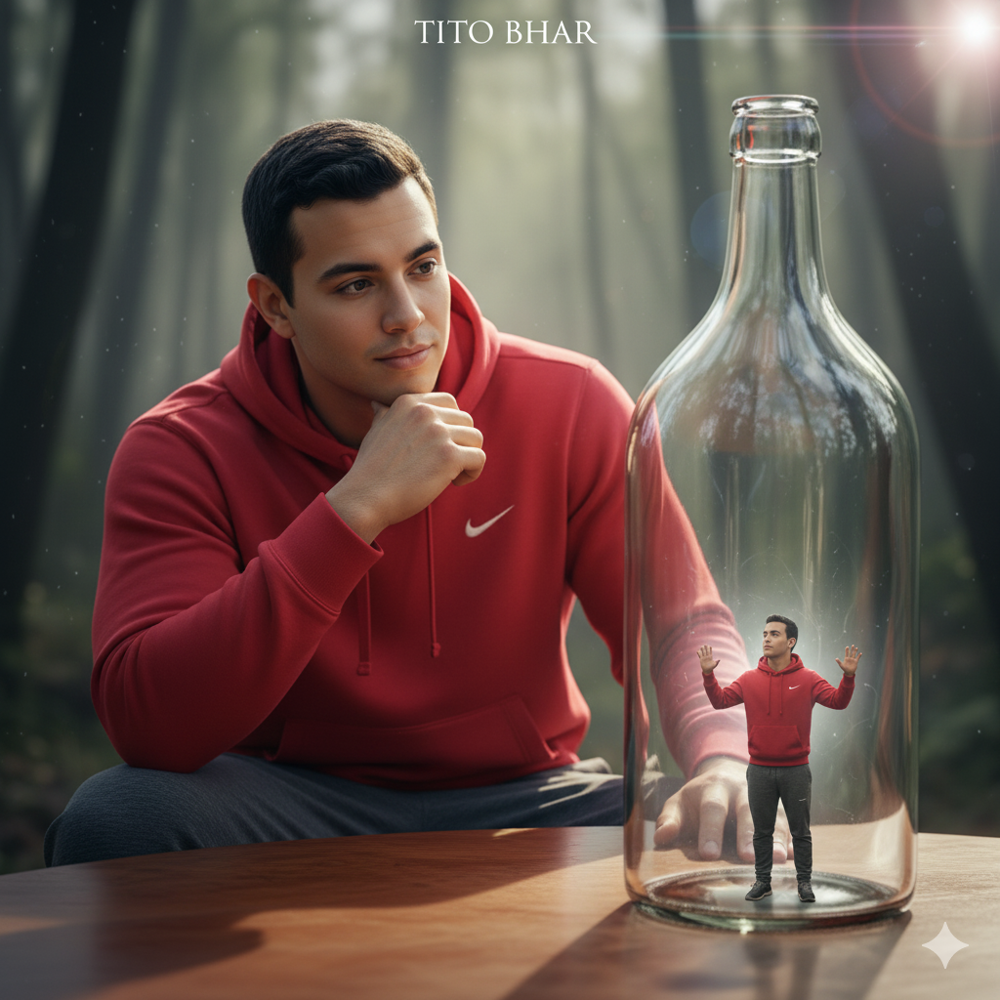
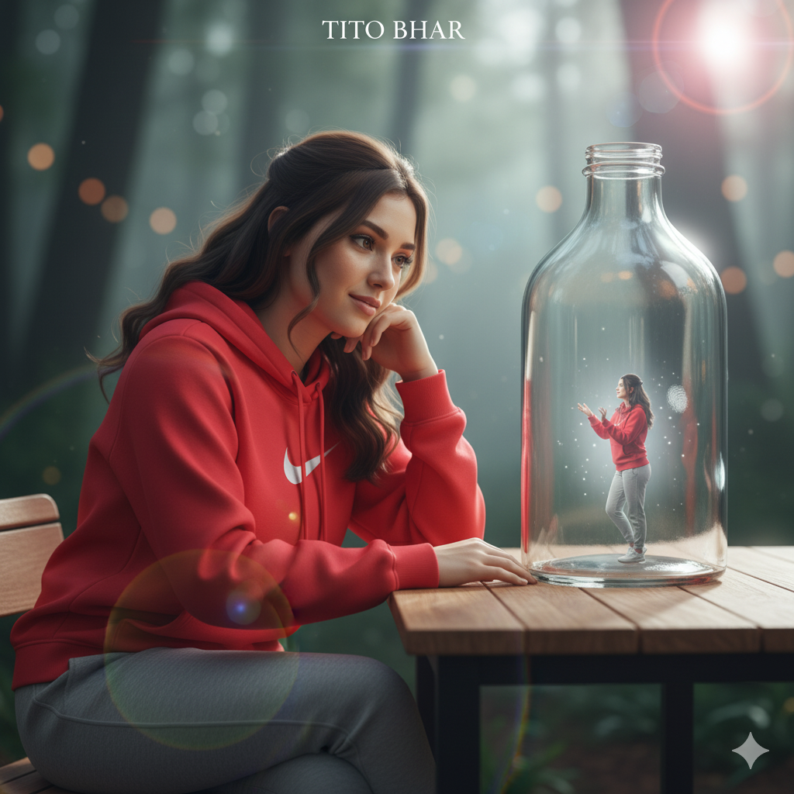

<h1>🎨 Gemini Prompt Samples</h1>

This page showcases example prompts and their corresponding generated images using the <strong>Gemini app</strong>. Each row contains the full prompt alongside the generated output image.

<h2>🖼 Reference Images for Prompt Generation</h2>

The following 3 images were used together with the prompts below to generate the sample images. Thees images were AI generated.

<table>
  <tr>
    <th>Image 1</th>
    <th>Image 2</th>
    <th>Image 3</th>
  </tr>
  <tr>
    <td>
      
    </td>
    <td>
      
    </td>
    <td>
      
    </td>
  </tr>
</table>
<table>
  <tr>
    <th style="width:70%; word-wrap: break-word;">Prompt</th>
    <th style="width:30%;">Sample Image</th>
  </tr>

  <tr>
    <td style="word-wrap: break-word;">
Photorealistic group selfie featuring [use uploaded image of the user] holding up a smartphone to take the photo. Surrounding him are the Justice League members — Superman, Batman, Wonder Woman, The Flash, Aquaman, and Cyborg — all smiling and posing casually like friends. The selfie has a fun, cheerful vibe, with everyone close together in frame, some characters leaning in playfully. Bright daylight, cinematic quality, natural colors, high detail."
    </td>
    <td>
      
    </td>
  </tr>

  <tr>
    <td style="word-wrap: break-word;">
Using the nano-banana model, create a 1/7 scale commercialized figurine of the characters in the picture, in a realistic style, in a real environment. The figurine is placed on a computer desk. The figurine has a round transparent acrylic base, with no text on the base. The content on the computer screen is the Zbrush modeling process of this figurine. Next to the computer screen is a BANDAI-style toy packaging box printed with the original artwork. The packaging features two-dimensional flat illustrations.
Please turn this photo into a figure. Behind it, there should be a model packaging box with the character from this photo printed on it. In front of the box, on a round plastic base, place the figure version of the photo I gave you. I'd like the PVC material to be clearly represented. It would be even better if the background is indoors. The PVC material figure will be standing very cool in style next to a highly detail realistic toy car model - Honda Stepwagon Spada E:HEV. Black / purple in colour
    </td>
    <td>
     
    </td>
  </tr>
 <tr>
    <td style="word-wrap: break-word;">
Use the nano-banana model to create a 1/7 scale model, in a realistic styie and environment. Place the figure on a computer desk, using a circular transparent acrylic base
without any text.On the computer screen, display the ZBrush modeling process of the figure.Next to the computer screen, place a TAMIYA-style toy packaging box printedwith the original artwork.
    </td>
    <td>
     
    </td>
  </tr>
  <tr>
    <td style="word-wrap: break-word;">
Prompt: Realistic style cartoon group selfie detailed generation description:

The image is a highly realistic, exquisite group selfie with vibrant colors and natural, authentic lighting, combining a real person with famous cartoon characters.

Main character (using the person from the user's uploaded photo):
Squatting at the very front of the frame, smiling brightly and naturally, with a happy expression. Their right hand is holding up a smartphone, clearly at a selfie angle, slightly turned but with their face directly facing the phone's camera.

Cartoon characters (all surrounding the main character, squeezing in from behind, all facing the camera together):

Mickey Mouse: Standing directly behind the main character, head slightly extended forward, face close to the main character's side profile, cheerfully making a V-sign, with prominent ears that stand out.

Minnie Mouse: Leaning closely beside Mickey Mouse, body leaning forward towards the camera, smiling and making a heart shape with her hands.

Doraemon: Happily standing behind the main character on the left side, head peeking out, round face close to the other characters, with a big smile.

Pikachu: Jumping to the area near the main character's right shoulder, face close to the camera, waving its paws, with an adorable expression.

Hello Kitty: Behind the main character on the left, head slightly tilted up towards the camera, with a small, smiling wave.

Donald Duck: Tucked in next to Pikachu, with a prominent beak, a comical expression, and his wings also squeezed into the frame as much as possible.

Mario: Making a victory sign, standing on the far right, with his head turned towards the group and the main character's face towards the camera.

Details and Scene:
All characters are completely and tightly clustered around the main character (no spreading out), ensuring that every face fits within the front phone's wide-angle selfie lens, with faces close to each other but not overlapping.
Each character's expression is natural, exaggerated, and has its own distinct style (e.g., Mickey's big laugh, Pikachu's cuteness, Donald's humor, etc.), all displaying playful poses that are relaxed and suited for a selfie atmosphere.
The lighting is bright, colors are rich and saturated, with clear layers of detail on faces, clothing, and other elements, creating a cinematic quality.
The background is a sunny city square or a theme park, with natural depth of field that doesn't steal focus; the main subject is the faces of the selfie group.

Overall Atmosphere:
Full of youthful vitality, with intimate character interaction, giving a strong sense of gathering and fun, as if it's a joyful selfie moment where fantasy and reality merge!
Realistic cinematic quality, but the characters retain their vibrant cartoon colors and unique charm.
    </td>
    <td>
      
    </td>
  </tr>

  <tr>
    <td style="word-wrap: break-word;">
Create an ultra-realistic 4K image of a man (see photo) wearing a yellow T-shirt with the Simpson logo, blue shorts and white On Cloud sneakers, sitting on the couch with the Simpons. Use Canon EOS R camera with a 50mm f/1.8 lens, f/2.2 aperture, 1/200s shutter speed, ISO 100 and natural light, full body, hyperrealistic photography, cinematic, cinema, hyper-detailed, ultra HD, color correction, ultra HDR, color calibration, 8k. Bottom right corner write "BY: ..." ». 
    </td>
    <td>
      
    </td>
  </tr>
  <tr>
    <td style="word-wrap: break-word;">
A photorealistic cinematic image of a man (uploaded image) sitting casually on the shoulder of a giant mecha style Gundam the Dragon from the anime Gundam-G. The man wears a body fit armor in color combination similar to the Gundam. Sitting in a relaxing pose and slightly muscular. The mecha is inspired by Gundam the Dragon in a green main color with minimal gold. It features a battle damaged Gundam.The background shows a technologically advanced city during a sunset hour, with soft shadows and atmospheric lighting. The buildings in the distance are blurred for depth of field. The scene is captured from a high-angle perspective to emphasize the massive scale difference between the man and the Gundam. Scale the person in a realistic true size of a gundam pilot.

Aspect ratio: 2:3, photorealistic, cinematic film-quality scene.
    </td>
    <td>
    
    </td>
  </tr>
   <tr>
    <td style="word-wrap: break-word;">
A photorealistic cinematic image of the photo attach, sitting casually on the shoulder of a giant mecha styled after Gundam in a combat style. The attached photo man wears a futuristic armour suit to match Gundam. His pose is relaxed: one hand resting at her side, the other holding a glowing blue katana crackling with blue sparks, resting across his shoulder. His legs dangle freely at the edge.
The mecha, inspired by classic Gundam designs, features the iconic white-blue-red-yellow color scheme, golden V-shaped antenna on its head, glowing eyes, and highly detailed mechanical panels.
The background shows a futuristic cityscape during a golden morning hour, with soft shadows and atmospheric lighting. The buildings in the distance are blurred for depth of field. The scene is shot from a high-angle perspective to emphasize the massive scale difference between the woman and the Gundam.
Aspect ratio: 2:3, photorealistic, cinematic film-quality scene.
    </td>
    <td>
    
       
      
    </td>
  </tr>
   <tr>
    <td style="word-wrap: break-word;">
一张超现实主义的照片，一位身着军装、戴着飞行员墨镜的男子（见图）随意地坐在一架巨大的、饱经战火的RX-78-2高达的右肩上。高达锈迹斑斑，留下了激烈战斗的痕迹。场景以低角度拍摄，景深较浅，聚焦于男子。背景是一座工业建筑，映衬着黄金时段的明亮天空。灯光效果戏剧化，极具电影感。杰作，超现实主义，照片级写实，8K分辨率。
    </td>
    <td>
    
    </td>
  </tr>
  <tr>
    <td style="word-wrap: break-word;">
Generate avatars of this person with 9 different professional styles 3x3: extreme happiness, shocked, furious anger, crying dramatically, evil smirk, confused, completely calm, terrified, blank face. Clean white studio background, cinematic lighting. Change my outfit is black t-shirt. Label each expression. 
    </td>
    <td>
    
    </td>
  </tr>
  <tr>
    <td style="word-wrap: break-word;">
Create a hyper-realistic 8K cinematic up-close photo of a man (use attached photo) performing an avatar bending stance outdoors. A swirling ring of all four elements—earth, air, water, and fire—surrounds him, forming a majestic dragon complete with claws, whiskers, glowing eyes, and dramatic twisting motion. The dragon appears alive, flowing from his hands with natural physics: cascading water with droplets, splashes, and refractions; swirling mist and wind gusts with dust and pebbles suspended in the air; blazing fire with sparks, embers, and heat distortion; rugged earth shards and rocks breaking apart mid-flight. The scene is set at golden hour with cinematic lighting, casting dramatic shadows and warm highlights across his face and body. Ultra-detailed textures, sharp focus on the man’s expression, with a shallow depth of field to make the elemental dragon appear grand and otherworldly, blending seamlessly into the environment. 
    </td>
    <td>
    
    </td>
  </tr>
  <tr>
    <td style="word-wrap: break-word;">
Create a hyper realistic 8K surreal cinematic selfie moment at the entrance of a luxury hotel in Saigon at night: me (the person from the uploaded photo, preserve the exact face and hairstyle) stands in the middle holding up a smartphone to take the selfie. Around me are Leonardo DiCaprio, Tom Cruise, Brad Pitt, and Daniel Craig, all leaning in casually, each dressed in their iconic elegant style, smiling naturally as if we just ran into each other by chance. They all look directly into the smartphone camera I am holding. The background shows the softly lit entrance of a luxury Saigon hotel at night, safe and cinematic, no signs or text. Hyperreal, cinematic style, shallow depth of field, fun atmosphere like an unplanned star encounter. 
    </td>
    <td>
    
    </td>
  </tr>
  <tr>
    <td style="word-wrap: break-word;">
Ultra-realistic 8K, 4:5 ratio, cinematic 3D CGI family photo. A man (based on the uploaded photo) wearing a varsity jacket, skinny jeans, and Jordan shoes, sitting on green grass in a Japanese suburban park under cherry blossom trees. Surrounding him are Nobita, Doraemon, Damulag (Gian), Suneo, and Shizuka, all smiling happily together, posed like a family picture. Playground structures are softly blurred in the background for depth of field. Lighting is natural daylight with a soft cinematic lens flare, ISO DSLR shot, mm lens effect for realism. The composition is warm, wholesome, and joyful, capturing the bond of friendship like a true family portrait.
    </td>
    <td>
    
    </td>
  </tr>
  </tr>
    <tr>
    <td style="word-wrap: break-word;">
The central figure, extracted from the uploaded image, is rendered in full, vibrant photorealistic color and sharp detail. They are dramatically lit to powerfully stand out. The background is an intricately detailed, multi-panel, black and white comic strip, entirely wordless and filled with humorous, exaggerated narratives directly featuring the central figure. These comic panels should not only depict the subject in funny, light-hearted, or slightly absurd scenarios, but also seamlessly integrate the central figure into the surrounding comic world. The colorful main subject should appear as if they are an integral part of this dynamic, monochromatic comic reality, perhaps 'stepping out' or 'frozen within' a specific comic panel, with their pose and expression directly interacting with the surrounding black and white narrative. The comic panels are drawn in a classic, high-contrast comic book style with bold lines, and creatively arranged to create a cohesive and engaging narrative backdrop, strongly linking the vibrant figure to the detailed monochrome comic environment.
    </td>
    <td>
    
    </td>
  </tr>
  </tr>
    <tr>
    <td style="word-wrap: break-word;">
A man is sitting on a wooden floor and beside him is appears to be a giant yellow chick bigger than him. On the floor are scattered giant cornseeds. Background is flat grey.
    </td>
    <td>
    
    </td>
  </tr>
  </tr>
    <tr>
    <td style="word-wrap: break-word;">
A surreal, ultra-realistic artwork of [the person in the uploaded picture]. Both versions of him are wearing a red Nike hoodie with the hood down and casual pants. The tiny version is shrunken inside a transparent glass bottle, standing in a relaxed pose, slightly reaching upward as if preparing to climb, but not touching the top of the bottle. Inside the bottle, a subtle soft white mystical glow highlights the tiny figure. The glass shows detailed reflections and refractions. Beside the bottle sits the giant version of him, relaxed and seated, resting one arm on the table, watching the small version with a calm, thoughtful expression, as if he created it. The scene is magical and imaginative, captured like a DSLR shot with mm lens and cinematic flare shot, ultra-detailed 8K resolution, with professional studio lighting that creates sharp highlights, clean reflections, and balanced shadows. At the very top of the image, the text "TITO BHAR" appears in elegant Ruthligos font, styled as a subtle, classy watermark, blending naturally with the composition. 
    </td>
    <td>
    
     
    
    </td>
  </tr>
</table>
