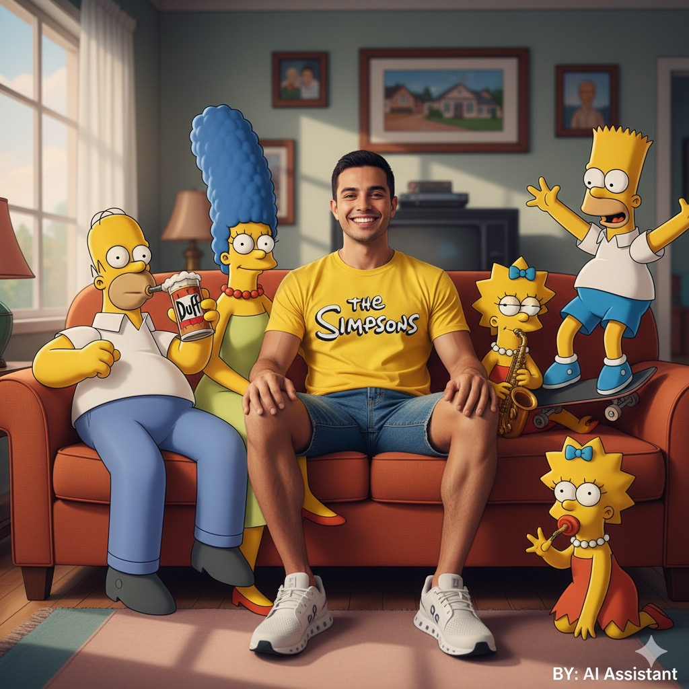
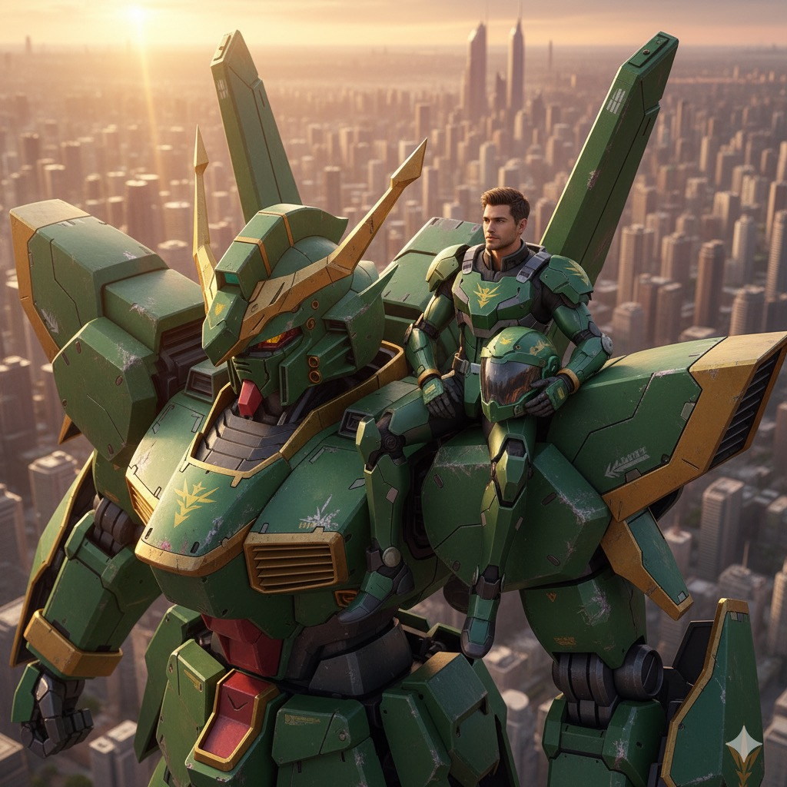
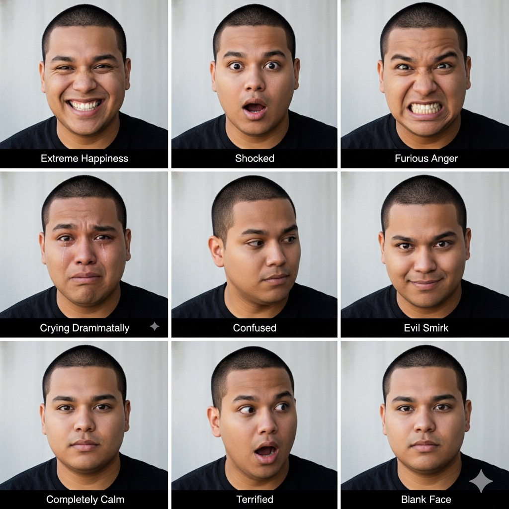
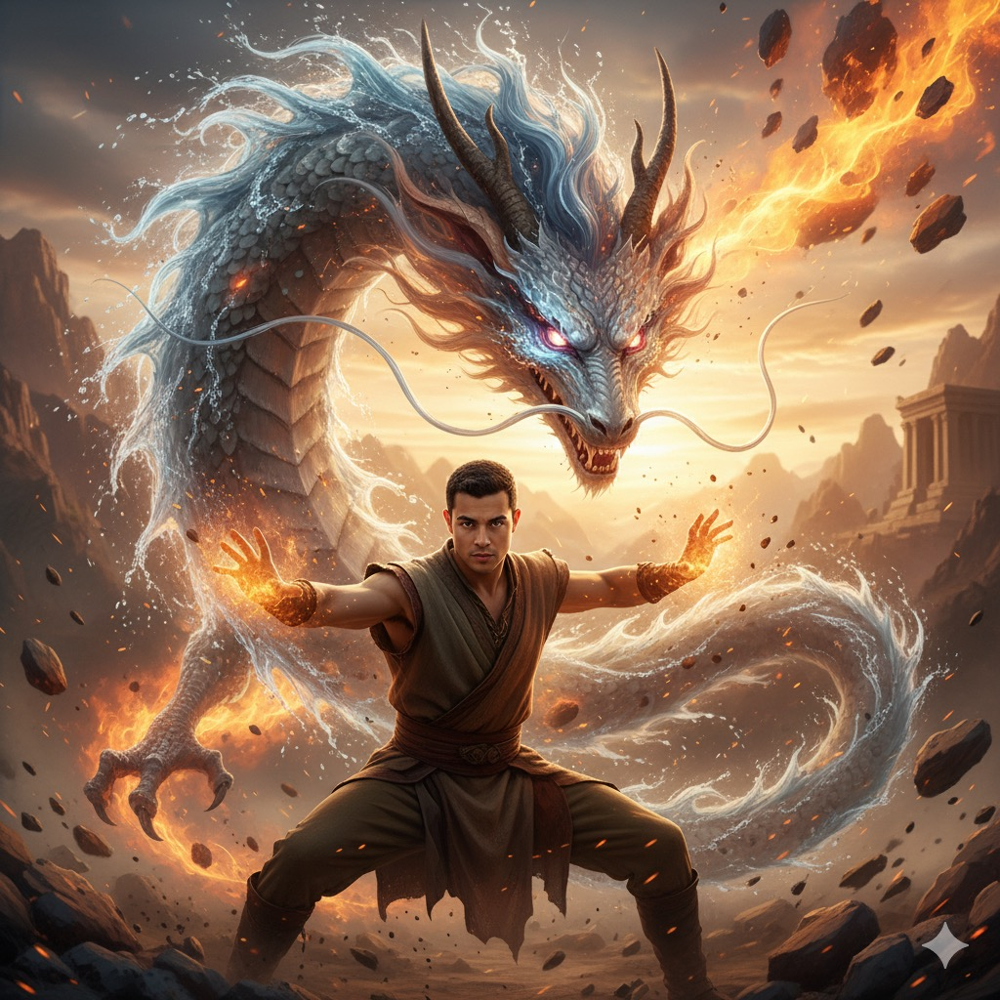

<h1>🎨 Gemini Prompt: Image Edit</h1>

This page showcases example prompts on how to futher enhance AI generated images using Nano Banana

<table>
  <tr>
    <th style="width:70%; word-wrap: break-word;">Prompt</th>
    <th style="width:30%;">Sample Image</th>
  </tr>

  <tr>
    <td style="word-wrap: break-word;">
Create a high-resolution, studio-quality product photo of a luxury leather handbag. The bag is centered, sharp, and well-lit against a clean white background with soft shadows for an e-commerce look. Capture fine details such as the texture of the leather, stitching, and metallic hardware. Lighting should be even and professional, highlighting the bag’s shape and craftsmanship. The composition should be minimal and elegant, focusing entirely on the product.
    </td>
    <td>
      
    </td>
  </tr>

  <tr>
    <td style="word-wrap: break-word;">
    <b>Change Color</b>
    Change the handbag color to a rich emerald green leather with gold accents.
    </td>
    <td>
     
    </td>
  </tr>

  <tr>
    <td style="word-wrap: break-word;">
Create an ultra-realistic 4K image of a man (see photo) wearing a yellow T-shirt with the Simpson logo, blue shorts and white On Cloud sneakers, sitting on the couch with the Simpons. Use Canon EOS R camera with a 50mm f/1.8 lens, f/2.2 aperture, 1/200s shutter speed, ISO 100 and natural light, full body, hyperrealistic photography, cinematic, cinema, hyper-detailed, ultra HD, color correction, ultra HDR, color calibration, 8k. Bottom right corner write "BY: ..." ». 
    </td>
    <td>
      
    </td>
  </tr>
  <tr>
    <td style="word-wrap: break-word;">
A photorealistic cinematic image of a man (uploaded image) sitting casually on the shoulder of a giant mecha style Gundam the Dragon from the anime Gundam-G. The man wears a body fit armor in color combination similar to the Gundam. Sitting in a relaxing pose and slightly muscular. The mecha is inspired by Gundam the Dragon in a green main color with minimal gold. It features a battle damaged Gundam.The background shows a technologically advanced city during a sunset hour, with soft shadows and atmospheric lighting. The buildings in the distance are blurred for depth of field. The scene is captured from a high-angle perspective to emphasize the massive scale difference between the man and the Gundam. Scale the person in a realistic true size of a gundam pilot.

Aspect ratio: 2:3, photorealistic, cinematic film-quality scene.
    </td>
    <td>
    
    </td>
  </tr>
  <tr>
    <td style="word-wrap: break-word;">
Generate avatars of this person with 9 different professional styles 3x3: extreme happiness, shocked, furious anger, crying dramatically, evil smirk, confused, completely calm, terrified, blank face. Clean white studio background, cinematic lighting. Change my outfit is black t-shirt. Label each expression. 
    </td>
    <td>
    
    </td>
  </tr>
    <tr>
    <td style="word-wrap: break-word;">
Create a hyper-realistic 8K cinematic up-close photo of a man (use attached photo) performing an avatar bending stance outdoors. A swirling ring of all four elements—earth, air, water, and fire—surrounds him, forming a majestic dragon complete with claws, whiskers, glowing eyes, and dramatic twisting motion. The dragon appears alive, flowing from his hands with natural physics: cascading water with droplets, splashes, and refractions; swirling mist and wind gusts with dust and pebbles suspended in the air; blazing fire with sparks, embers, and heat distortion; rugged earth shards and rocks breaking apart mid-flight. The scene is set at golden hour with cinematic lighting, casting dramatic shadows and warm highlights across his face and body. Ultra-detailed textures, sharp focus on the man’s expression, with a shallow depth of field to make the elemental dragon appear grand and otherworldly, blending seamlessly into the environment. 
    </td>
    <td>
    
    </td>
  </tr>
</table>
